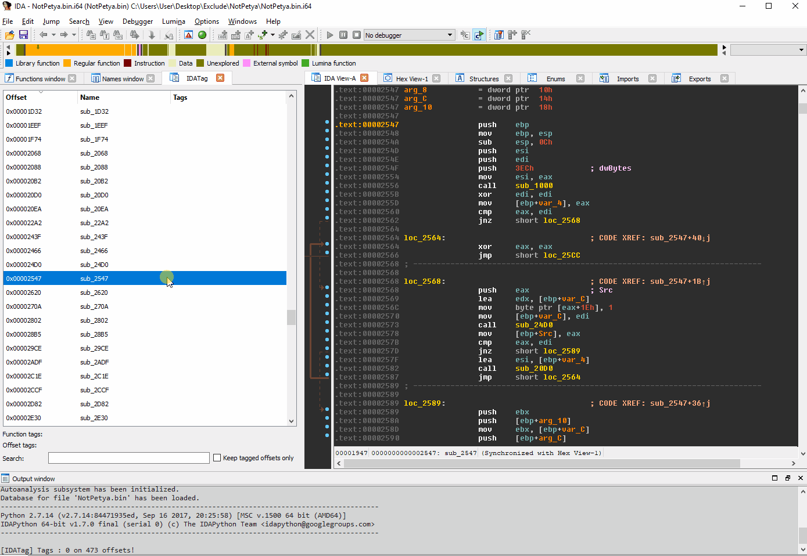
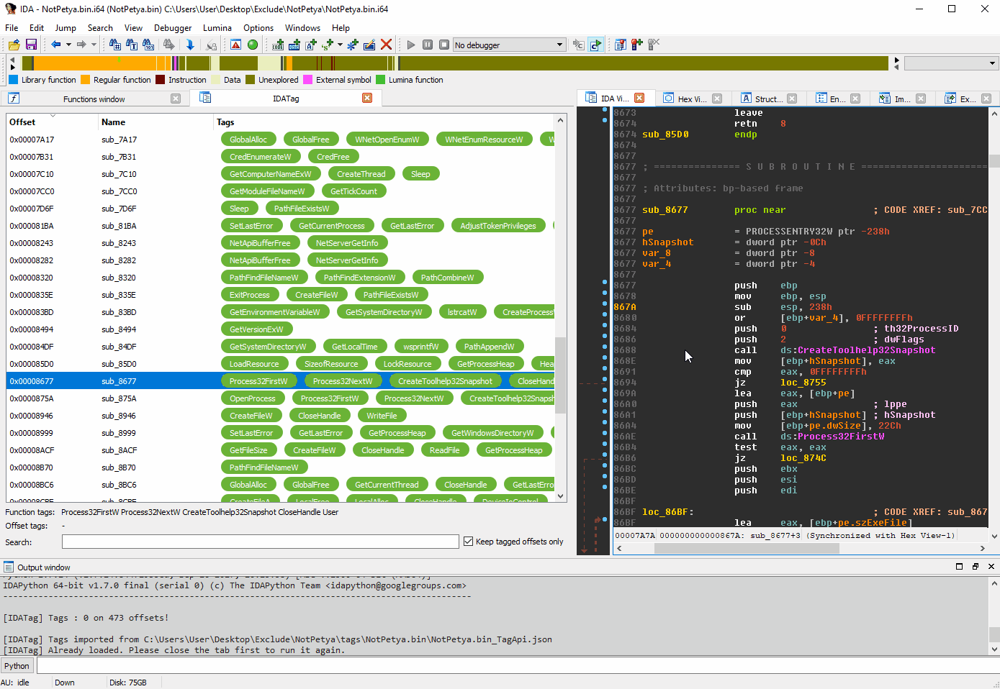
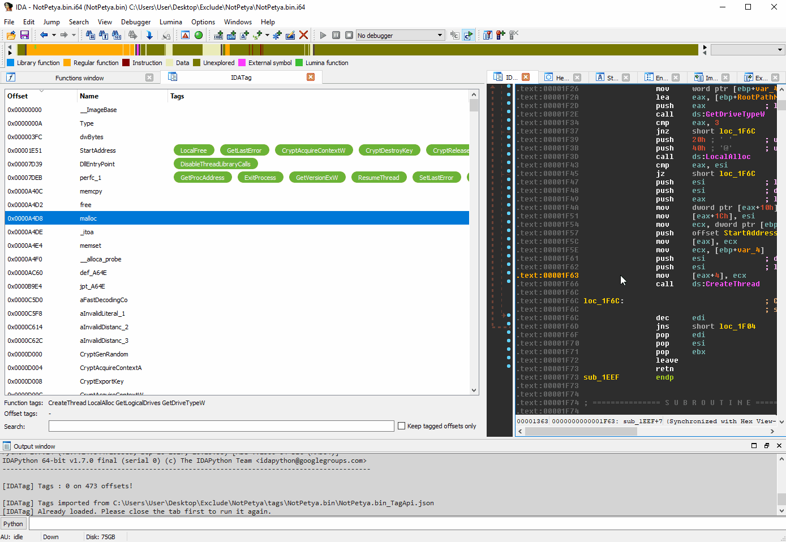
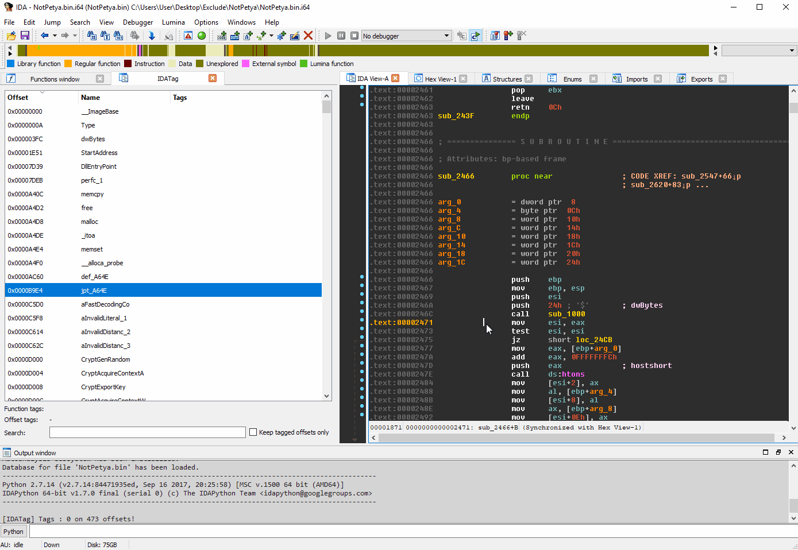
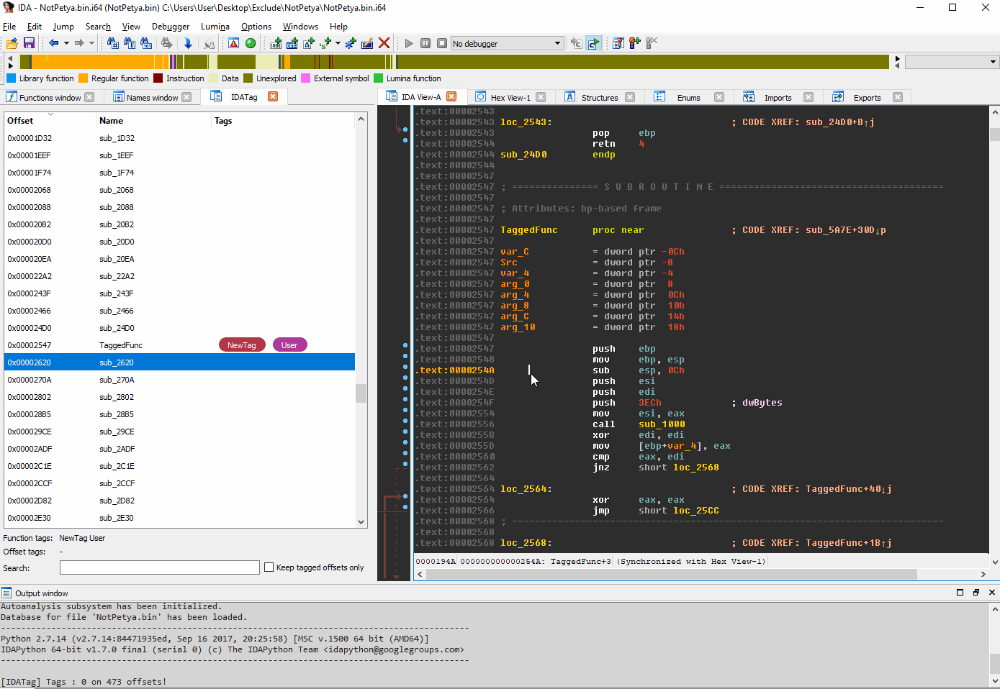

# IDATag - Tag explorer for IDA Pro

When analyzing a binary, a reverser using IDA will rename functions, comment, add bookmarks.

Moreover, this actions are available only from the IDA environment (IDA, IDA scripting or plugins).

However, this usage does not allow to have a global view of the analysis. Also, the different conventions to document an IDB may differ.

Finally, adding information from an external tools is not possible (except with scripts or plugins).

The idea behind IDATag is to offer a centralized way/view to document an IDB from IDA or from any other external tool.

## Overview

IDATag is a tag plugin for [IDA Pro](https://www.hex-rays.com/products/ida/). The plugin leverages IDA as a platform to map, explore, and visualize collected tags.

Tags can come from multiple sources such as IDA itself or different other clients.

## Releases

* v0.3 -- Build on Linux, SDK IDA 7.3 , bug fix 
* v0.2 -- Additional interactivity with IDATag from IDA
* v0.1 -- Initial release

The plugin is in active development, some bugs may appear. Thanks to let me know!

## Building

### Requirements

* Qt 5.6.3 (IDA version)
* IDA SDK (7.0 and above)
* msvc 15.7 or gcc-8 (std::filesystem required)
* msvc, g++, cmake
* libgl-dev 

### IDA Pro (32-bit)

#### Linux

```sh
export IDASDK=/opt/idafree-7.0/idasdk73
export IDATARGET=IDA32NUX
mkdir Ida32Build
cd Ida32Build
cmake -G"Unix Makefiles" ..
make
```
#### Windows

```sh
set IDASDK=C:\Program Files\IDA Pro 7.3\idasdk73
set IDATARGET=IDA32WIN
"C:\Program Files (x86)\Microsoft Visual Studio\2019\Professional\VC\Auxiliary\Build\vcvars64.bat"
mkdir Ida32Build
cd Ida32Build
cmake -G"Visual Studio 16 2019" -A x64 ..
cmake --build . --config RelWithDebInfo
```

The build binary can be found in `bin\IDATag_x64\` directory:
* `IDATag.dll` for IDA Pro 32-bit

### IDA Pro (64-bit)

#### Linux

```sh
export IDASDK=/opt/idafree-7.0/idasdk73
export IDATARGET=IDA64NUX
mkdir Ida64Build
cd Ida64Build
cmake -G"Unix Makefiles" ..
make
```
#### Windows

```sh
set IDASDK=C:\Program Files\IDA Pro 7.3\idasdk73
set IDATARGET=IDA64WIN
"C:\Program Files (x86)\Microsoft Visual Studio\2019\Professional\VC\Auxiliary\Build\vcvars64.bat"
mkdir Ida64Build
cd Ida64Build
cmake -G"Visual Studio 16 2019" -A x64 ..
cmake --build . --config RelWithDebInfo
```

> WARNING: no quotes for the IDASDK path!
> Example : 
> ```sh
> set IDASDK=C:\Program Files\IDA Pro 7.3\idasdk73
> ```

The build binary can be found in `bin\IDATag_x64\` directory:
* `IDATag64.dll` for IDA Pro 64-bit

## Installation

Just copy the built dll file in the IDA Pro plugin directory.

> REMARK: you can also create a symbolic link to th target dll. 
> for example, in an Admin prompt:
> ```
> mklink IDATag.dll c:\dev\IDATag\bin\IDATag_x64\IDATag.dll
> mklink IDATag64.dll c:\dev\IDATag\bin\IDATag_x64\IDATag64.dll
> ```

> This plugin targets IDA Pro version 7.0 and above only.
> This plugin has not been tested on Linux.

## Usage

IDATag loads automatically when an IDB is opened. To open the view, you may use the `Ctrl+Alt+T` shorcut.

## Tag Overview

The Tag Overview is a dockable widget that provides view of the referenced tags. 



These tags can come from multiple entry points:
* IDB functions 
* IDB names 
* Disassembly 
* External JSON tag file



The JSON tag file is a pivot to each IDATag client. 

Every tools that could create a JSON file with a specific structure is able to feed your IDA view. The JSON contract has been designed as minimalist.

For instance, the following JSON is used to tag a specific offset with two tags:

```
[
	{
		"tag": "crypto",
		"offset": 5065078,
		"feeder": "tagcrypt"
	},
	{
		"tag": "SHA-1",
		"offset": 5065078,
		"feeder": "tagcrypt"
	}
]
```

* Tag : label of the tag
* Offset : RVA of the offset (make sure of the base used when generating a tag and the IDB base)
* Feeder : signature of the tag

Each tag in the IDATag view is displayed with a specific colour corresponding to its feeder (tag signature).



This table can be sorted by column, and entries can be double clicked to jump to their corresponding disassembly. Moreover, multiple filters are available to facilitate the navigation:
* Keep only tagged offsets
* Textual filter (with case)
* Feeder filter

When textually filtered a tag will be highlighted in the view.

Also, it is possible to add tags from IDA by:
* Double-clicking the tag case of a specific offset
* Typing in a selected tag cell
* From contextual menu in Functions view
* From contextual menu in Names view
* From contextual menu in Disassembly view

Tagging from IDA will automatically add an User tag to follow up the work done. 

Finally, all the tags may be modified the same way through the IDATag view.

## Context Menu

Right clicking the table in the Tag Overview will produce a context menu with a few basic amenities.

* Export Tags to a JSON file
* Filter by feeders (IDATag client)
* Refresh tags from files
* Reset filters
* Paint offset (not implemented yet)

Also, IDATag contextual menu is accessible from different views:
* Functions view
* Names view
* Disassembly view



## Configuration

The plugin can be configured with a specific folder to store tag files and username.
The menu is accessible at 'Edit > [IDATag] Configuration'.



## IDA integration

Multiple hooks have been deployed to automatically tag the database:
* Patch event
* Rename event
* Comment event

Other event might be supported in the near future (eg. new_file).

## Tag version

It is possible to ensure the good usage of a tag on a specific IDB by adding a hash value in the tag file.
This hash value should correspond to the hashsum of the binary.

```
[
	{
		"hash": "2E6E67FF68755B3CD8236F0FFA1A05D6"
		"tag": "crypto",
		"offset": 5065078,
		"feeder": "tagcrypt"
	}
]
```

# Tag clients

One of the main goal of IDATag is to make IDA extensible. It can takes as input json files generated by other tools.

Several clients are provided in the `client` folder:

* TagMetaRebase - rebase tags
* TagPcap - extract tags from Icebox pcap file
* TagAPI - generate tags based on IAT xrefs
* TagFuncRefs - generate tags based on function xrefs
* TagSource - generate tags based on source file strings
* TagString - generate tags based on strings
